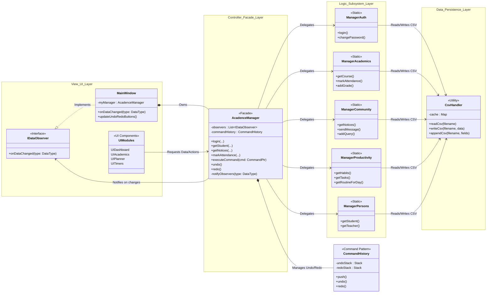
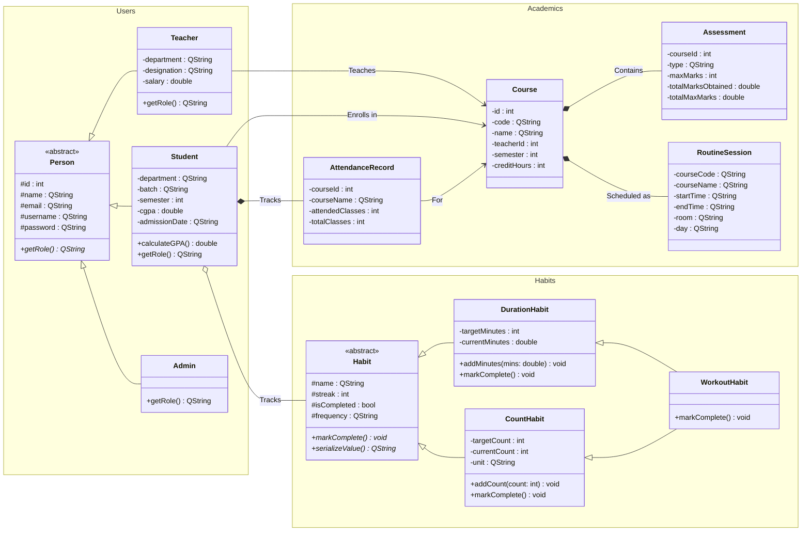
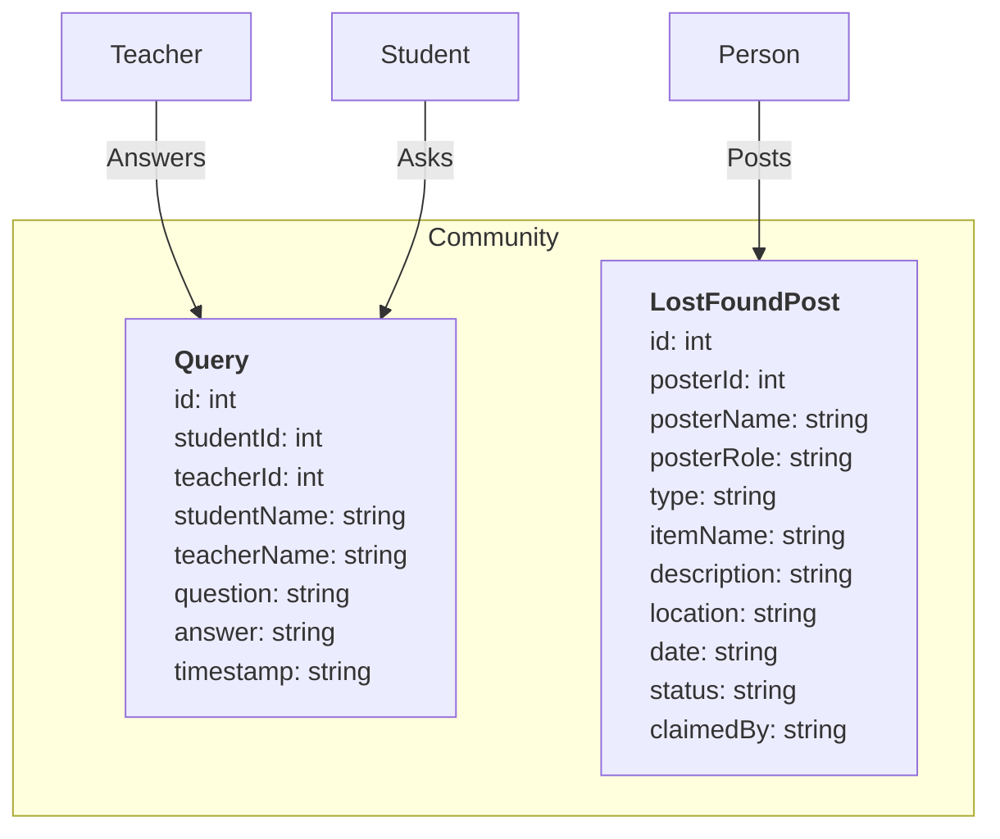
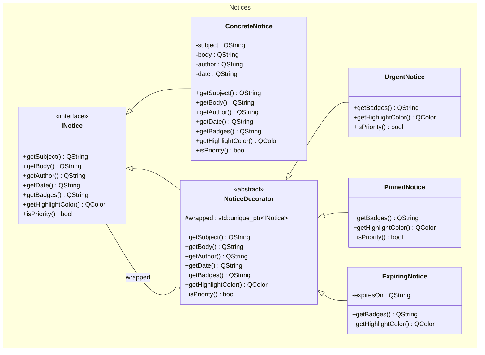

# Acadence
---

## 📖 Table of Contents

1. [Introduction](#-introduction)
2. [Project Structure](#-project-structure)
3. [System Architecture (How it Works)](#-system-architecture-how-it-works)
4. [Object-Oriented Programming (OOP) in Acadence](#-object-oriented-programming-oop-in-acadence)
    - [Inheritance & Polymorphism](#1-inheritance--polymorphism)
    - [Design Patterns Explanation](#2-design-patterns-explanation)
5. [Key Modules & Functionality](#-key-modules--functionality)
6. [Data Persistence (CSV)](#-data-persistence-csv)
7. [Installation & Build](#-installation-and-build)

---

## 🎓 Introduction

**Acadence** is a comprehensive Academic Management System built using **C++17** and the **Qt 6** framework. It is designed to demonstrate advanced Object-Oriented Programming (OOP) concepts in a real-world application.

Acadence is like a digital campus. It serves three types of users, each with a specific set of functionalities:

1.  **Students**: Manage tasks, view grades, track attendance, and build habits.
2.  **Teachers**: Manage courses, mark attendance, and grade assessments.
3.  **Admins**: Manage the database (users, courses, notices).

Unlike simple apps that put all code in one file, Acadence uses a **Modular Architecture** where the user interface (UI) is strictly separated from the logic (Backend).

---

## 📂 Project Structure

Here is how the files are organized on your computer:

- **`src/` (Source Files)**: Contains the `.cpp` files where the actual logic and function implementations live.
    - `main.cpp`: The entry point. It starts the application.
    - `mainwindow.cpp`: The central hub that holds all other UI pages.
    - `acadencemanager.cpp`: The "Brain" of the operation (see Facade pattern below).
    - `ui_*.cpp`: Files starting with `ui_` handle specific screens (e.g., `ui_academics.cpp` handles the Grades/Attendance screen).
    - `manager_*.cpp`: Files handling logic (e.g., `manager_auth.cpp` handles Login).

- **`include/` (Header Files)**: Contains `.hpp` files. These are the "Blueprints". They declare _what_ classes and functions exist, while `src` defines _how_ they work. e.g.,
    - `person.hpp`, `student.hpp`: Blueprints for User classes.

- **`assets/data/`**: The database. We use **CSV files** to store data.
    - `students.csv`: Stores ID, Name, Password, GPA.
    - `attendance.csv`: Stores who attended which class.

---

## 🏗️ System Architecture (How it works)

The system follows a **3-Layer Architecture** to keep code clean.

### 1. The View Layer (UI)

This is what you see.

- **Files**: `mainwindow.cpp`, `ui_dashboard.cpp`, `ui_academics.cpp`.
- **Job**: It detects clicks and input texts from the user and asks the Manager to do the work. It does **not** calculate anything or read files directly.

### 2. The Controller Layer (Facade)

This acts as the intermediary.

- **File**: `AcadenceManager` (The Facade).
- **Job**: The UI talks _only_ to `AcadenceManager`. The UI says `myManager->login(...)`. The Manager then figures out which specific logic file handles login. This makes the UI simple.

### 3. The Logic/Data Layer

This is where the heavy lifting happens.

- **Files**: `manager_auth.cpp`, `manager_academics.cpp`, `csvhandler.cpp`.
- **Job**: These files actually calculates the important stuffs, check passwords, and data against the CSV files, and write data back.

---

## 🧩 Object-Oriented Programming (OOP) in Acadence

### 1. Class Inheritance Hierarchy

#### A. User System (`Person` Hierarchy)

The system uses a base class `Person` to handle common authentication and profile attributes.

- **`Person` (Abstract Base)**
    - **Inherited by**: Student, Teacher, Admin
    - **Attributes**: `id`, `name`, `email`, `username`, `password`
    - **`Student`** (Derived)
        - **New Attributes**: `cgpa`, `semester`, `department`, `admissionDate`
    - **`Teacher`** (Derived)
        - **New Attributes**: `designation`, `salary`, `department`

#### B. Habit System (Polymorphism)

Habits share a common interface but behave differently based on their type.

- **`Habit` (Abstract Base)**
    - **Attributes**: `name`, `streak`, `frequency`, `isCompleted`
    - **Virtual Methods**: `markComplete()`, `serializeValue()`
- **`Derived Classes:`** 
    - **`CountHabit`**: Overrides `markComplete` to increment a counter (e.g., 1/8 glasses).
    - **`DurationHabit`**: Overrides `markComplete` to add time (e.g., 15/30 mins).
    - **`WorkoutHabit`**: Inherits both `CountHabit` and `DurationHabit`.


### 2. Design Patterns Explanation

#### 🏢 Facade Pattern (`AcadenceManager`)

There are a few different manager classes (`ManagerAuth`, `ManagerAcademics`, `ManagerCommunity`, `ManagerPersons`, `ManagerProductivity`). If the UI had to include all of them, the code would be a mess. So We create one "Facade" class called `AcadenceManager`. The UI only speaks to this one class.

#### 🎀 Decorator Pattern (Notices)

- **Problem**: Notices can be "Urgent", "Pinned", "Expiring", or a mix of all three. Creating classes like `UrgentPinnedExpiringNotice` is bad.
- **Solution**: We wrap notices in layers.
    - Start with a `ConcreteNotice` (Basic text).
    - Wrap it in `UrgentNotice` (Adds red color).
    - Wrap that in `PinnedNotice` (Moves it to the top).
    - _Code Example_: `notice_decorators.hpp`

#### 📊 Strategy Pattern (GPA Calculation)

- **Problem**: Some universities use a 4.0 scale, others use Percentage. We might want to switch easily.
- **Solution**: We define an interface `IGPAStrategy`.
    - `PercentageGPAStrategy`: Calculates based on raw %.
    - `LetterGradeGPAStrategy`: Converts marks to A/B/C then to points.
    - The UI can swap the strategy at runtime without changing the calculation code.

#### 🏭 Factory Pattern (`PersonFactory`)

- **Problem**: When reading the "login" CSV, we get a string "Student" or "Teacher". We need to create the correct C++ object.
- **Solution**: A factory function takes the string "Student" and returns a `new Student()` object.

#### ⏪ Command Pattern (Undo/Redo)

- **Problem**: Users frequently make mistakes, such as deleting a task or marking the wrong attendance, and expect a way to reverse them.
- **Solution**: We encapsulate operations into command objects (`ICommand`) that know how to `execute()` and `undo()` themselves. `AcadenceManager` keeps a history stack of these commands, providing a system-wide Undo/Redo feature.
    - _Code Example_: `icommand.hpp` and `commands.hpp`

---

## 🔑 Key Modules & Functionality

### 1. Authentication (`ManagerAuth`)

- **How it works**:
    1.  User enters username/password.
    2.  `ManagerAuth::login` opens `students.csv`, `teachers.csv`, and `admins.csv` one by one.
    3.  It loops through every row.
    4.  If it finds a match, it returns the `UserId` and `Role`.

### 2. Academics & Attendance (`UIAcademics`)

- **Student View**:
    - Calculates attendance percentage: `(Classes Attended / Total Classes) * 100`.
    - **Colors**: Green (>85%), Orange (60-85%), Red (<60%).
    - **Prediction**: The "Attendance Simulator" allows students to see "What if I miss the next 3 classes?".
- **Teacher View**:
    - Teachers select a course.
    - A table loads with all students in that course.
    - Checkboxes allow marking Present/Absent.
    - Clicking "Save" writes a new column to `attendance.csv`.

### 3. Admin Panel (`UIAdmin` & `CsvDelegate`)

- **Raw Data Editor**: Admins can see the raw CSV data in a table.
- **Validation**: We use a `CsvDelegate` (in `src/csvdelegate.cpp`).
    - When an Admin edits a cell, the Delegate checks the input.
    - _Example_: If editing a GPA column, it ensures the number is between 0.00 and 4.00.

### 4. Notices System

- Notices are stored in `notices.csv` with a "Content" column that looks like JSON.
- When loading, the system reads these flags and applies the **Decorators** (Red background for urgent) dynamically.

### 5. Productivity (Planner & Timers)

- **Study Planner**: Students can maintain a list of `Task` items, tracking daily assignments.
- **Timers**: Focus timers and workout stopwatches are tightly integrated, automatically updating `Habit` progress upon completion.

### 6. Community Features

- **Lost & Found**: A campus-wide board where users can post and claim lost items.
- **Q&A Queries**: Students can submit questions to specific teachers, and teachers can reply within the app.
- **Direct Messaging**: Teachers can send private, direct messages to students (e.g., personal grade reports with notes).

---

## 💾 Data Persistence (CSV)

All data is saved in `assets/data/`. You can open these files with Excel to see the data.

| File                | Purpose                                                                         |
| :------------------ | :------------------------------------------------------------------------------ |
| **students.csv**    | Contains `ID,Name,Email,Username,Password,Dept,Batch,Semester,DateJoined,CGPA`. |
| **teachers.csv**    | Contains `ID,Name,Email,Username,Password,Dept,Designation,Salary`.             |
| **courses.csv**     | Links a Course Name to a Teacher ID.                                            |
| **enrollments.csv** | Links a Student ID to a Course ID.                                              |
| **attendance.csv**  | A massive table where rows are students and columns are dates.                  |
| **habits.csv**      | Stores the state of user habits.                                                |
| **tasks.csv**       | Stores student study tasks and completion status.                               |
| **queries.csv**     | Stores Q&A threads between students and teachers.                               |
| **messages.csv**    | Stores private inbox messages.                                                  |
| **lostfound.csv**   | Stores campus lost and found items.                                             |
| **prayers.csv**     | Stores daily prayer tracker logs.                                               |

**The CsvHandler Class**:
This is a helper utility that reads a file into a list of strings (`QVector<QStringList>`). It handles the commas and newlines so the rest of the app doesn't have to worry about parsing text.

---

## Facade Pattern



## Academics Subsystem



## Community Subsystem



## Notices Subsystem



---

## 💻 Installation and Build

### Prerequisites

1. **C++ Compiler**: You need a compiler that supports C++17 (e.g., GCC, MSVC, Clang).
2. **CMake**: The build system (version 3.16 or higher).
3. **Qt 6**: You must have the Qt 6 libraries installed (Core, Widgets, Multimedia).

### Steps to Run

1. **Create a build folder**:

    ```bash
    mkdir build
    cd build
    ```

2. **Configure with CMake**:

    ```bash
    cmake ..
    ```

3. **Compile**:

    ```bash
    cmake --build .
    ```

4. **Run**:
    - **Windows**: `.\Acadence.exe`
    - **Linux/Mac**: `./Acadence`

_Note: On the first run, the app will generate default CSV files in `assets/data` if they are missing. The default Admin login is `admin` / `admin`._

````

### Running the App

On Linux/macOS:
```bash
./Acadence
````

On Windows:

```powershell
.\Acadence.exe
```

> **Note:** On first run, the application will automatically create the `assets/data` directory and populate it with default seed data (Admin credentials: `admin` / `admin`).
