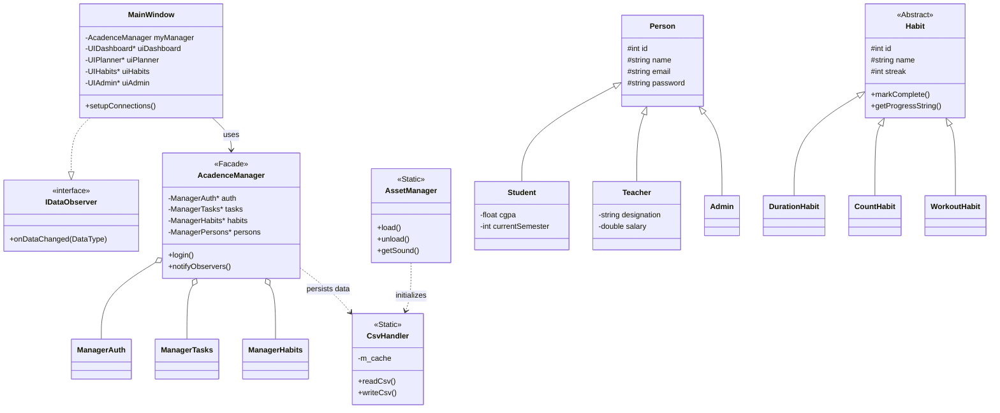

# Acadence


## 🎓 Introduction

**Acadence** is a role-based desktop Academic Management System built with **C++17** and **Qt 6 Widgets**. It provides a unified interface for students, teachers, and administrators, while persisting data in CSV files.

The codebase is intentionally OOP-heavy and demonstrates multiple design patterns across real feature modules (authentication, routine planning, notices, academics, reports, and admin operations).

##  System Architecture & UML

The system follows a modular architecture where the `MainWindow` acts as the primary view controller, orchestrating various specialized UI modules (`UIDashboard`, `UIPlanner`, etc.). The logic is decoupled using the `AcadenceManager` facade, which routes requests to specific domain managers (e.g., `ManagerAuth`, `ManagerAcademics`).

### High-Level Class Diagram



## 🚀 Key Features

### 👤 Student Features
- **Dashboard**: Real-time stats, GPA, attendance overview, and graphical performance charts.
- **Study Planner**: Task management with priority tracking and "Focus Timer" (Pomodoro style).
- **Habit Tracker**: Polymorphic habit tracking (Duration, Count, Workout) with streak persistence.
- **Academics**: View grades, attendance risk levels, and simulate CGPA using Strategy pattern.
- **Routine**: Dynamic schedule view handling rescheduled or cancelled classes.
- **Tamagotchi**: A fun productivity companion that reacts to task completion.

### 👨‍🏫 Teacher Features
- **Routine Management**: Cancel or reschedule classes; updates reflect instantly for students.
- **Assessment Tools**: Create quizzes/assignments and input grades with validation.
- **Attendance**: Mark attendance per class; system auto-generates warnings for low attendance.
- **Q&A**: Reply to student queries directly from the dashboard.

### 🛡️ Admin Features
- **Global Search**: Trie-based search suggestions for finding records quickly.
- **CRUD Operations**: Full control over all CSV data tables via a proxy-filtered view.
- **Notices**: Post targeted notices to specific audiences (All, Students, Teachers).

## 🛠️ Design Patterns Implemented

The project strictly adheres to OOP principles and utilizes several GoF design patterns:

| Pattern | Usage in Acadence |
| :--- | :--- |
| **Facade** | `AcadenceManager` provides a simplified interface to the complex subsystem of domain managers. |
| **Observer** | `MainWindow` implements `IDataObserver` to react to data changes (e.g., new notices). |
| **Strategy** | `IGPAStrategy` allows switching between Percentage-based and Letter-Grade-based calculations. |
| **Decorator** | Notice decorators (`UrgentNotice`, `PinnedNotice`) dynamically add visual behaviors to notices. |
| **Factory Method** | `PersonFactory` creates specific user instances (`Student`, `Teacher`) based on role strings. |
| **Template Method** | `IReport` defines the skeleton for generating reports (CSV/Text) while subclasses implement formatting. |
| **Iterator** | `StudentIterator` allows traversal over student collections without exposing internal structure. |
| **Proxy** | `QSortFilterProxyModel` acts as a proxy for the Admin table view to handle sorting and filtering. |
| **Singleton** | `DatabaseManager` ensures a single point of access for database maintenance tasks. |

## 📂 Data Files

The project uses a custom CSV persistence layer (`CsvHandler`) cached in memory (`AssetManager`) for performance.

| File | Purpose |
| :--- | :--- |
| `admins.csv` | Admin credentials and profile basics. |
| `students.csv` | Student identity, login, department, semester, CGPA. |
| `teachers.csv` | Teacher identity, login, department, designation, salary. |
| `courses.csv` | Course metadata, teacher mapping, semester, credits. |
| `enrollments.csv` | Student-course enrollment mappings. |
| `routine.csv` | Baseline weekly class routine. |
| `routine_adjustments.csv` | Routine overrides (`CANCEL`/`RESCHEDULE`). |
| `attendance.csv` | Attendance entries by student/course/date. |
| `assessments.csv` | Assessment definitions (course/title/type/date/max marks). |
| `grades.csv` | Marks per student-assessment pair. |
| `tasks.csv` | Student planner tasks. |
| `habits.csv` | Habit definitions and serialized progress. |
| `prayers.csv` | Daily prayer completion records. |
| `queries.csv` | Student-teacher Q&A records. |
| `notices.csv` | Posted notice records consumed by dashboard feed. |
| `themes.csv` | Theme-related persisted data. |

## 💻 Installation and Build

### Prerequisites
- **C++17** compiler.
- **CMake** `>= 3.16`.
- **Qt 6** (Core, Widgets, Multimedia).

### Build Steps

```bash
mkdir -p build
cd build
cmake ..
cmake --build .
```

### Running the App

On Linux/macOS:
```bash
./Acadence
```

On Windows:
```powershell
.\Acadence.exe
```

> **Note:** On first run, the application will automatically create the `assets/data` directory and populate it with default seed data (Admin credentials: `admin` / `admin`).