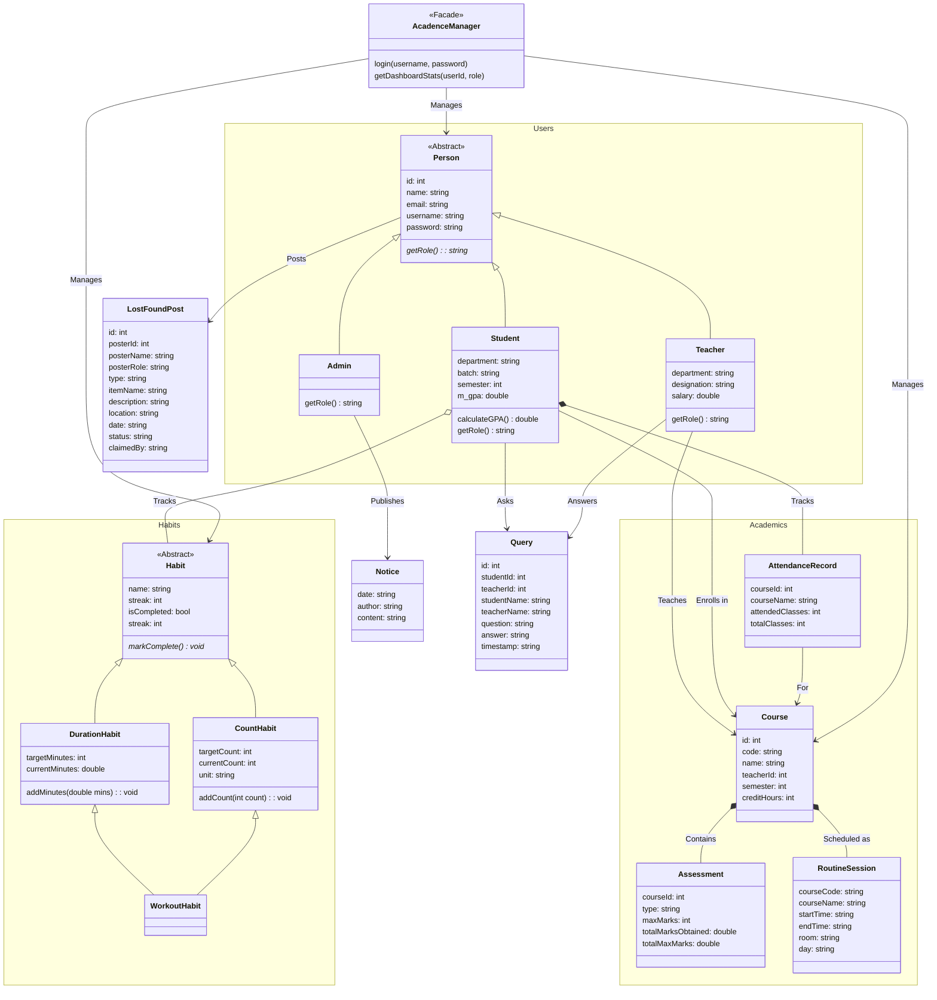

# Acadence System UML Architecture

```mermaid
classDiagram

%% direction LR

    class AcadenceManager {
        <<Facade>>
        login(username, password)
        getDashboardStats(userId, role)
    }

%% --- Academics Subsystem ---
namespace Academics {
    class Course {
        id: int
        code: string
        name: string
        teacherId: int
        semester: int
        creditHours: int
    }

    class Assessment {
        courseId: int
        type: string
        maxMarks: int
        totalMarksObtained: double
        totalMaxMarks: double
    }

    class AttendanceRecord {
        courseId: int
        courseName: string
        attendedClasses: int
        totalClasses: int
    }

    class RoutineSession {
        courseCode: string
        courseName: string
        startTime: string
        endTime: string
        room: string
        day: string
    }
}

%% --- User & Factory Logic ---
namespace Users {

    class Person {
        <<Abstract>>
        id: int
        name: string
        email: string
        username: string
        password: string
        getRole()* : string
    }

    class Student {
        department: string
        batch: string
        semester: int
        m_gpa: double
        calculateGPA() double
        getRole() string
    }

    class Teacher {
        department: string
        designation: string
        salary: double
        getRole() string
    }

    class Admin {
        getRole() string
    }
}

%% --- Habit Subsystem ---

namespace Habits {

    class Habit {
        <<Abstract>>
        name: string
        streak: int
        isCompleted: bool
        streak: int
        markComplete()* void
    }

    class DurationHabit {
        targetMinutes: int
        currentMinutes: double
        addMinutes(double mins): void
    }

    class CountHabit {
        targetCount: int
        currentCount: int
        unit: string
        addCount(int count): void
    }

    class WorkoutHabit {
    }

}

%% Academic Relationships
Teacher --> Course : Teaches
Student --> Course : Enrolls in
Course *-- Assessment : Contains
Course *-- RoutineSession : Scheduled as
Student *-- AttendanceRecord : Tracks
AttendanceRecord --> Course : For

%% User & Factory Logic
Person <|-- Teacher
Person <|-- Admin
Person <|-- Student

%% Habit Subsystem
Habit <|-- CountHabit
Habit <|-- DurationHabit
DurationHabit <|-- WorkoutHabit
CountHabit <|-- WorkoutHabit
Student o-- Habit : Tracks

%% Facade Relationships
AcadenceManager --> Person : Manages
AcadenceManager --> Course : Manages
AcadenceManager --> Habit : Manages


%% --- Community Subsystem ---

    class Notice {
        date: string
        author: string
        content: string
    }

    class Query {
        id: int
        studentId: int
        teacherId: int
        studentName: string
        teacherName: string
        question: string
        answer: string
        timestamp: string
    }

    class LostFoundPost {
        id: int
        posterId: int
        posterName: string
        posterRole: string
        type: string
        itemName: string
        description: string
        location: string
        date: string
        status: string
        claimedBy: string
    }

%% Community Relationships
Person --> LostFoundPost : Posts
Student --> Query : Asks
Teacher --> Query : Answers
Admin --> Notice : Publishes

```
