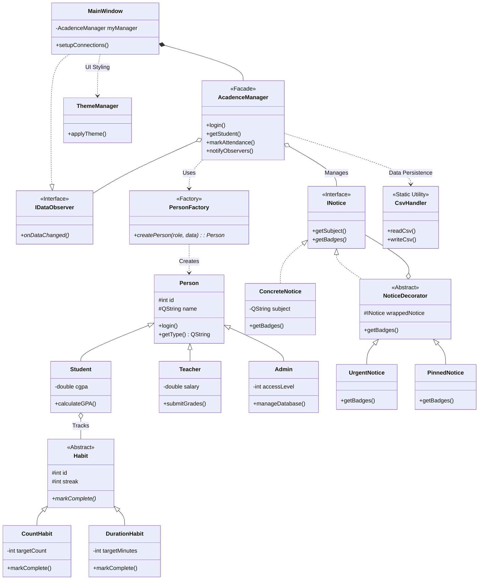

# Acadence System UML Architecture

```mermaid
classDiagram
    %% --- Management & UI Core ---
    class MainWindow {
        -AcadenceManager myManager
        +setupConnections()
    }

    class AcadenceManager {
        <<Facade>>
        +login()
        +getStudent()
        +markAttendance()
        +notifyObservers()
    }

    class IDataObserver {
        <<Interface>>
        +onDataChanged()*
    }

    MainWindow *-- AcadenceManager
    MainWindow ..|> IDataObserver
    AcadenceManager o-- IDataObserver

    %% --- User & Factory Logic ---
    class Person {
        #int id
        #QString name
        +login()
        +getType() QString
    }

    class Student {
        -double cgpa
        +calculateGPA()
    }

    class Teacher {
        -double salary
        +submitGrades()
    }

    class Admin {
        -int accessLevel
        +manageDatabase()
    }

    class PersonFactory {
        <<Factory>>
        +createPerson(role, data) : Person*
    }

    Person <|-- Student
    Person <|-- Teacher
    Person <|-- Admin
    PersonFactory ..> Person : Creates
    AcadenceManager ..> PersonFactory : Uses

    %% --- Habit Subsystem ---
    class Habit {
        <<Abstract>>
        #int id
        #int streak
        +markComplete()*
    }

    class CountHabit {
        -int targetCount
        +markComplete()
    }

    class DurationHabit {
        -int targetMinutes
        +markComplete()
    }

    Habit <|-- CountHabit
    Habit <|-- DurationHabit
    Student o-- Habit : Tracks

    %% --- Notice & Decorator Pattern ---
    class INotice {
        <<Interface>>
        +getSubject()
        +getBadges()*
    }

    class ConcreteNotice {
        -QString subject
        +getBadges()
    }

    class NoticeDecorator {
        <<Abstract>>
        #INotice wrappedNotice
        +getBadges()
    }

    class UrgentNotice {
        +getBadges()
    }

    class PinnedNotice {
        +getBadges()
    }

    INotice <|.. ConcreteNotice
    INotice <|.. NoticeDecorator
    NoticeDecorator o-- INotice
    NoticeDecorator <|-- UrgentNotice
    NoticeDecorator <|-- PinnedNotice
    
    AcadenceManager o-- INotice : Manages

    %% --- Utilities ---
    class CsvHandler {
        <<Static Utility>>
        +readCsv()
        +writeCsv()
    }

    class ThemeManager {
        +applyTheme()
    }

    AcadenceManager ..> CsvHandler : Data Persistence
    MainWindow ..> ThemeManager : UI Styling
```