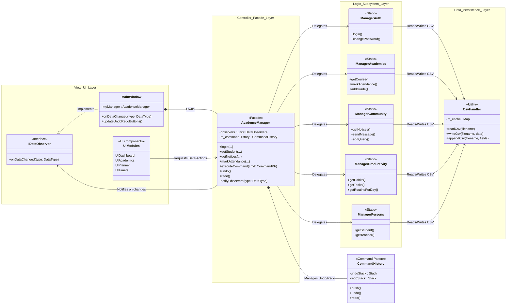
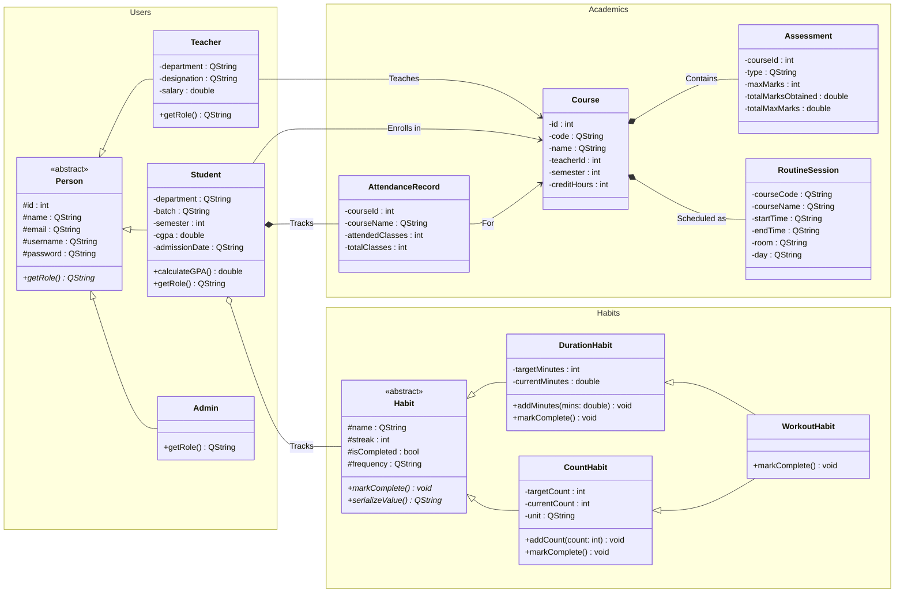
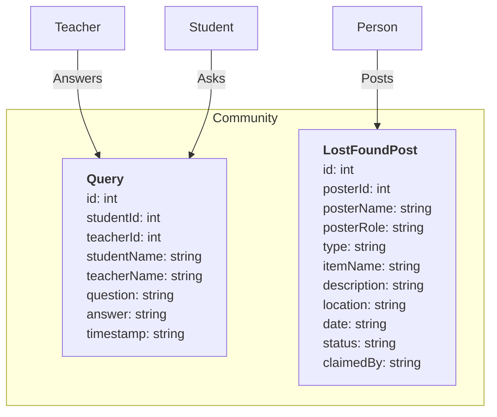
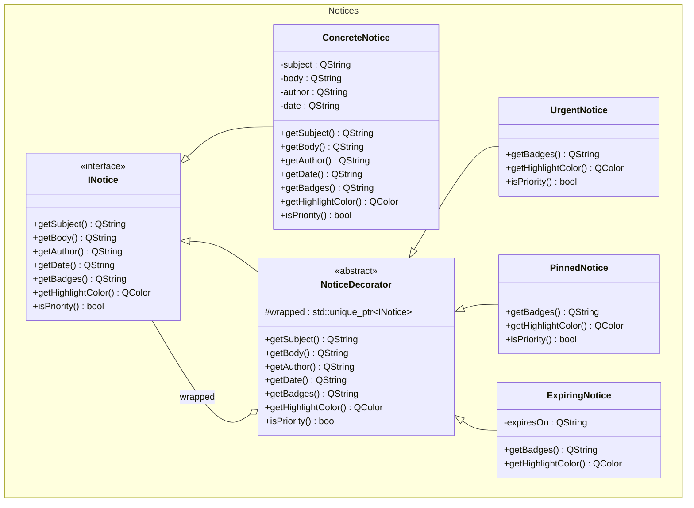

# Facade Pattern

```mermaid
classDiagram
direction LR
    %% --- 1. VIEW / UI LAYER ---
    namespace View_UI_Layer {
        class IDataObserver {
            <<Interface>>
            +onDataChanged(type: DataType)
        }

        class MainWindow {
            -myManager : AcadenceManager
            +onDataChanged(type: DataType)
            +updateUndoRedoButtons()
        }

        class UIModules {
            <<UI Components>>
            UIDashboard
            UIAcademics
            UIPlanner
            UITimers
        }
    }

    class CommandHistory {
            <<Command Pattern>>
            -undoStack : Stack
            -redoStack : Stack
            +push()
            +undo()
            +redo()
        }

    %% --- 2. CONTROLLER / FACADE LAYER ---
    namespace Controller_Facade_Layer {
        class AcadenceManager {
            <<Facade>>
            -observers : List~IDataObserver~
            -m_commandHistory : CommandHistory
            +login(...)
            +getStudent(...)
            +getNotices(...)
            +markAttendance(...)
            +executeCommand(cmd: CommandPtr)
            +undo()
            +redo()
            -notifyObservers(type: DataType)
        }
    }

    %% --- 3. LOGIC / SUBSYSTEM LAYER ---
    namespace Logic_Subsystem_Layer {
        class ManagerAuth {
            <<Static>>
            +login()
            +changePassword()
        }
        class ManagerAcademics {
            <<Static>>
            +getCourse()
            +markAttendance()
            +addGrade()
        }
        class ManagerCommunity {
            <<Static>>
            +getNotices()
            +sendMessage()
            +addQuery()
        }
        class ManagerProductivity {
            <<Static>>
            +getHabits()
            +getTasks()
            +getRoutineForDay()
        }
        class ManagerPersons {
            <<Static>>
            +getStudent()
            +getTeacher()
        }
    }

    %% --- 4. DATA ACCESS LAYER ---
    namespace Data_Persistence_Layer {
        class CsvHandler {
            <<Utility>>
            -m_cache : Map
            +readCsv(filename)
            +writeCsv(filename, data)
            +appendCsv(filename, fields)
        }
    }

    %% Inter-layer relationships
    IDataObserver <|.. MainWindow : Implements
    MainWindow *-- AcadenceManager : Owns
    UIModules --> AcadenceManager : Requests Data/Actions
    AcadenceManager --> IDataObserver : Notifies on changes

    AcadenceManager *-- CommandHistory : Manages Undo/Redo

    %% Facade Delegation
    AcadenceManager --> ManagerAuth : Delegates
    AcadenceManager --> ManagerAcademics : Delegates
    AcadenceManager --> ManagerCommunity : Delegates
    AcadenceManager --> ManagerProductivity : Delegates
    AcadenceManager --> ManagerPersons : Delegates

    %% Data Access
    ManagerAuth --> CsvHandler : Reads/Writes CSV
    ManagerAcademics --> CsvHandler : Reads/Writes CSV
    ManagerCommunity --> CsvHandler : Reads/Writes CSV
    ManagerProductivity --> CsvHandler : Reads/Writes CSV
    ManagerPersons --> CsvHandler : Reads/Writes CSV

```

# Academics Subsystem

```mermaid
classDiagram

direction LR


namespace Academics {
    class Course {
        -id : int
        -code : QString
        -name : QString
        -teacherId : int
        -semester : int
        -creditHours : int
    }

    class Assessment {
        -courseId : int
        -type : QString
        -maxMarks : int
        -totalMarksObtained : double
        -totalMaxMarks : double
    }

    class AttendanceRecord {
        -courseId : int
        -courseName : QString
        -attendedClasses : int
        -totalClasses : int
    }

    class RoutineSession {
        -courseCode : QString
        -courseName : QString
        -startTime : QString
        -endTime : QString
        -room : QString
        -day : QString
    }
}

%% --- User & Factory Logic ---
namespace Users {

    class Person {
        <<abstract>>
        #id : int
        #name : QString
        #email : QString
        #username : QString
        #password : QString
        +getRole()* QString
    }

    class Student {
        -department : QString
        -batch : QString
        -semester : int
        -cgpa : double
        -admissionDate : QString
        +calculateGPA() double
        +getRole() QString
    }

    class Teacher {
        -department : QString
        -designation : QString
        -salary : double
        +getRole() QString
    }

    class Admin {
        +getRole() QString
    }
}

%% --- Habit Subsystem ---

namespace Habits {

    class Habit {
        <<abstract>>
        #name : QString
        #streak : int
        #isCompleted : bool
        #frequency : QString
        +markComplete()* void
        +serializeValue()* QString
    }

    class DurationHabit {
        -targetMinutes : int
        -currentMinutes : double
        +addMinutes(mins: double) void
        +markComplete() void
    }

    class CountHabit {
        -targetCount : int
        -currentCount : int
        -unit : QString
        +addCount(count: int) void
        +markComplete() void
    }

    class WorkoutHabit {
        +markComplete() void
    }

}

%% Academic Relationships
Teacher --> Course : Teaches
Student --> Course : Enrolls in
Course *-- Assessment : Contains
Course *-- RoutineSession : Scheduled as
Student *-- AttendanceRecord : Tracks
AttendanceRecord --> Course : For

%% User & Factory Logic
Person <|-- Teacher
Person <|-- Admin
Person <|-- Student

%% Habit Subsystem
Habit <|-- CountHabit
Habit <|-- DurationHabit
DurationHabit <|-- WorkoutHabit
CountHabit <|-- WorkoutHabit
Student o-- Habit : Tracks

```

# Community Subsystem

```mermaid
flowchart TB
    %% --- Community Subsystem ---
    subgraph Community
        direction TB
        Query["`**Query**
        id: int
        studentId: int
        teacherId: int
        studentName: string
        teacherName: string
        question: string
        answer: string
        timestamp: string`"]

        LostFoundPost["`**LostFoundPost**
        id: int
        posterId: int
        posterName: string
        posterRole: string
        type: string
        itemName: string
        description: string
        location: string
        date: string
        status: string
        claimedBy: string`"]
    end
    
    %% Simple Rectangles
    Teacher[Teacher]
    Student[Student]
    Person[Person]

    %% Relationships
    Teacher -->|Answers| Query
    Student -->|Asks| Query
    Person -->|Posts| LostFoundPost
    
    %% Styling to make it look more like UML
    style Query text-align:left
    style LostFoundPost text-align:left

```

# Notices Subsystem

```mermaid
classDiagram

%% --- Notices Subsystem ---

namespace Notices {
class INotice {
        <<interface>>
        +getSubject() QString
        +getBody() QString
        +getAuthor() QString
        +getDate() QString
        +getBadges() QString
        +getHighlightColor() QColor
        +isPriority() bool
    }

    class ConcreteNotice {
        -subject : QString
        -body : QString
        -author : QString
        -date : QString
        +getSubject() QString
        +getBody() QString
        +getAuthor() QString
        +getDate() QString
        +getBadges() QString
        +getHighlightColor() QColor
        +isPriority() bool
    }

    class NoticeDecorator {
        <<abstract>>
        #wrapped : std::unique_ptr~INotice~
        +getSubject() QString
        +getBody() QString
        +getAuthor() QString
        +getDate() QString
        +getBadges() QString
        +getHighlightColor() QColor
        +isPriority() bool
    }

    class UrgentNotice {
        +getBadges() QString
        +getHighlightColor() QColor
        +isPriority() bool
    }

    class PinnedNotice {
        +getBadges() QString
        +getHighlightColor() QColor
        +isPriority() bool
    }

    class ExpiringNotice {
        -expiresOn : QString
        +getBadges() QString
        +getHighlightColor() QColor
    }
}
    %% Inheritance relationships
    INotice <|-- ConcreteNotice
    INotice <|-- NoticeDecorator
    NoticeDecorator <|-- UrgentNotice
    NoticeDecorator <|-- PinnedNotice
    NoticeDecorator <|-- ExpiringNotice

    %% Aggregation (Decorator wrapping the component)
    NoticeDecorator o-- INotice : wrapped
```