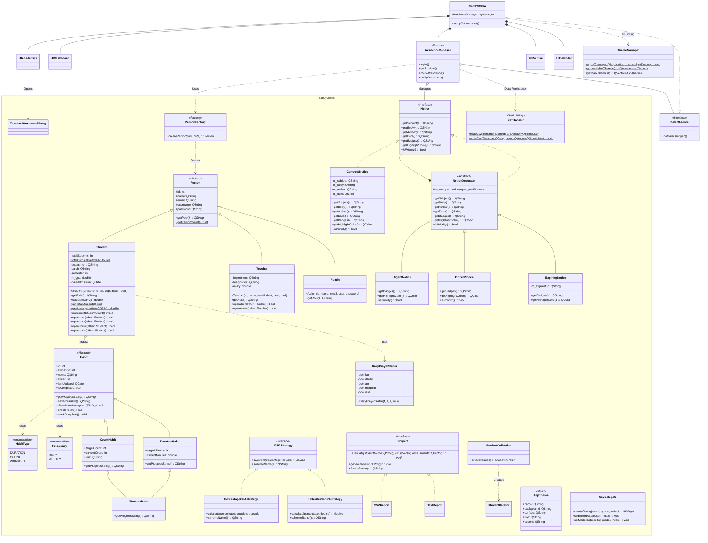

# Acadence System UML Architecture

```mermaid
classDiagram

    %%direction LR

    %% --- Management & UI Core ---

    class MainWindow {
        -AcadenceManager myManager
        +setupConnections()
    }

    class AcadenceManager {
        <<Facade>>
        +login()
        +getStudent()
        +markAttendance()
        +notifyObservers()
    }

    class IDataObserver {
        <<Interface>>
        +onDataChanged()*
    }

    MainWindow *-- AcadenceManager
    MainWindow ..|> IDataObserver
    AcadenceManager o-- IDataObserver

    class UIDashboard
    class UIAcademics
    class UIRoutine
    class UICalendar

    class ThemeManager {
        +applyTheme(a: QApplication, theme: AppTheme)$ : void
        +getAvailableThemes()$ : QVector~AppTheme~
        +getDarkThemes()$ : QVector~AppTheme~
    }

    MainWindow *-- UIDashboard
    MainWindow *-- UIAcademics
    MainWindow *-- UIRoutine
    MainWindow *-- UICalendar
    MainWindow ..> ThemeManager : UI Styling

    namespace Subsystems {
        class TeacherAttendanceDialog

        %% --- User & Factory Logic ---
        class Person {
            <<Abstract>>
            #id: int
            #name: QString
            #email: QString
            #username: QString
            #password: QString

            +getRole()* : QString
            +getPersonCount()$ : int
        }

        class Student {
            -totalStudents: int$
            -totalCumulativeCGPA: double$
            -department: QString
            -batch: QString
            -semester: int
            -m_gpa: double
            -dateAdmission: QDate

            +Student(id, name, email, dept, batch, sem)
            +getRole() QString
            +calculateGPA() double
            +getTotalStudents() int$
            +getAverageInstituteCGPA() double$
            +incrementStudentCount() void$
            +operator<(other: Student) bool
            +operator>(other: Student) bool
            +operator==(other: Student) bool
            +operator!=(other: Student) bool
        }

        class Teacher {
            -department: QString
            -designation: QString
            -salary: double

            +Teacher(id, name, email, dept, desig, sal)
            +getRole() QString
            +operator<(other: Teacher) bool
            +operator==(other: Teacher) bool
        }

        class Admin {
            +Admin(id, name, email, user, password)
            +getRole() QString
        }

        class PersonFactory {
            <<Factory>>
            +createPerson(role, data) : Person*
        }

        %% --- Habit Subsystem ---

        class HabitType {
            <<enumeration>>
            DURATION
            COUNT
            WORKOUT
        }

        class Frequency {
            <<enumeration>>
            DAILY
            WEEKLY
        }

        class Habit {
            <<Abstract>>
            +id: int
            +studentId: int
            +name: QString
            +streak: int
            +lastUpdated: QDate
            +isCompleted: bool
            +getProgressString()* QString
            +serializeValue()* QString
            +deserializeValue(val: QString)* void
            +checkReset() bool
            +markComplete() void
        }

        class DurationHabit {
            +targetMinutes: int
            +currentMinutes: double
            +getProgressString() QString
        }

        class CountHabit {
            +targetCount: int
            +currentCount: int
            +unit: QString
            +getProgressString() QString
        }

        class WorkoutHabit {
            +getProgressString() QString
        }

        class DailyPrayerStatus {
            -bool fajr
            -bool dhuhr
            -bool asr
            -bool maghrib
            -bool isha

            +DailyPrayerStatus(f, d, a, m, i)
        }


        %% --- Notice & Decorator Pattern ---
        class INotice {
            <<Interface>>
            +getSubject()* : QString
            +getBody()* : QString
            +getAuthor()* : QString
            +getDate()* : QString
            +getBadges()* : QString
            +getHighlightColor()* : QColor
            +isPriority()* : bool
        }

        class ConcreteNotice {
            -m_subject: QString
            -m_body: QString
            -m_author: QString
            -m_date: QString
            +getSubject() : QString
            +getBody() : QString
            +getAuthor() : QString
            +getDate() : QString
            +getBadges() : QString
            +getHighlightColor() : QColor
            +isPriority() : bool
        }

        class NoticeDecorator {
            <<Abstract>>
            #m_wrapped: std::unique_ptr~INotice~
            +getSubject() : QString
            +getBody() : QString
            +getAuthor() : QString
            +getDate() : QString
            +getBadges() : QString
            +getHighlightColor() : QColor
            +isPriority() : bool
        }

        class UrgentNotice {
            +getBadges() : QString
            +getHighlightColor() : QColor
            +isPriority() : bool
        }

        class PinnedNotice {
            +getBadges() : QString
            +getHighlightColor() : QColor
            +isPriority() : bool
        }

        class ExpiringNotice {
            -m_expiresOn: QString
            +getBadges() : QString
            +getHighlightColor() : QColor
        }

        %% --- Strategy Pattern (GPA Calculation) ---
        class IGPAStrategy {
            <<Interface>>
            +calculate(percentage: double)* : double
            +schemeName()* : QString
        }
        class PercentageGPAStrategy {
            +calculate(percentage: double) : double
            +schemeName() : QString
        }
        class LetterGradeGPAStrategy {
            +calculate(percentage: double) : double
            +schemeName() : QString
        }

        %% --- Report Subsystem (Polymorphism) ---
        class IReport {
            <<Interface>>
            +setData(studentName: QString, att: QVector, assessments: QVector)* : void
            +generate(path: QString)* : void
            +formatName()* : QString
        }
        class CSVReport { }
        class TextReport { }

        %% --- Iterator Pattern ---
        class StudentCollection {
            +createIterator() : StudentIterator
        }
        class StudentIterator { }

        %% --- Utilities ---
        class CsvHandler {
            <<Static Utility>>
            +readCsv(filename: QString)$ : QVector~QStringList~
            +writeCsv(filename: QString, data: QVector~QStringList~)$ : void
        }

        class AppTheme {
            <<struct>>
            +name: QString
            +background: QString
            +surface: QString
            +text: QString
            +accent: QString
        }

        class CsvDelegate {
            +createEditor(parent, option, index) : QWidget*
            +setEditorData(editor, index) : void
            +setModelData(editor, model, index) : void
        }
    }

    %% --- Relationships ---

    %% User & Factory Logic
    Person <|-- Student
    Person <|-- Teacher
    Person <|-- Admin
    PersonFactory ..> Person : Creates
    AcadenceManager ..> PersonFactory : Uses

    %% Habit Subsystem
    Habit ..> HabitType : uses
    Habit ..> Frequency : uses
    Habit <|-- CountHabit
    Habit <|-- DurationHabit
    DurationHabit <|-- WorkoutHabit
    CountHabit <|-- WorkoutHabit
    Student o-- Habit : Tracks
    Student ..> DailyPrayerStatus : uses

    %% Notice & Decorator Pattern
    INotice <|.. ConcreteNotice
    INotice <|.. NoticeDecorator
    NoticeDecorator *-- INotice
    NoticeDecorator <|-- UrgentNotice
    NoticeDecorator <|-- PinnedNotice
    NoticeDecorator <|-- ExpiringNotice
    AcadenceManager o-- INotice : Manages

    %% Strategy Pattern (GPA Calculation)
    IGPAStrategy <|.. PercentageGPAStrategy
    IGPAStrategy <|.. LetterGradeGPAStrategy

    %% Report Subsystem (Polymorphism)
    IReport <|.. CSVReport
    IReport <|.. TextReport

    %% Iterator Pattern
    StudentCollection ..> StudentIterator : Creates

    UIAcademics ..> TeacherAttendanceDialog : Opens

    AcadenceManager ..> CsvHandler : Data Persistence
```
